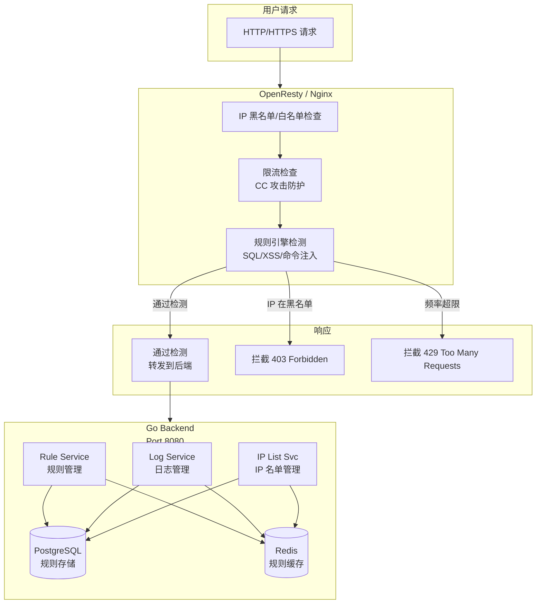
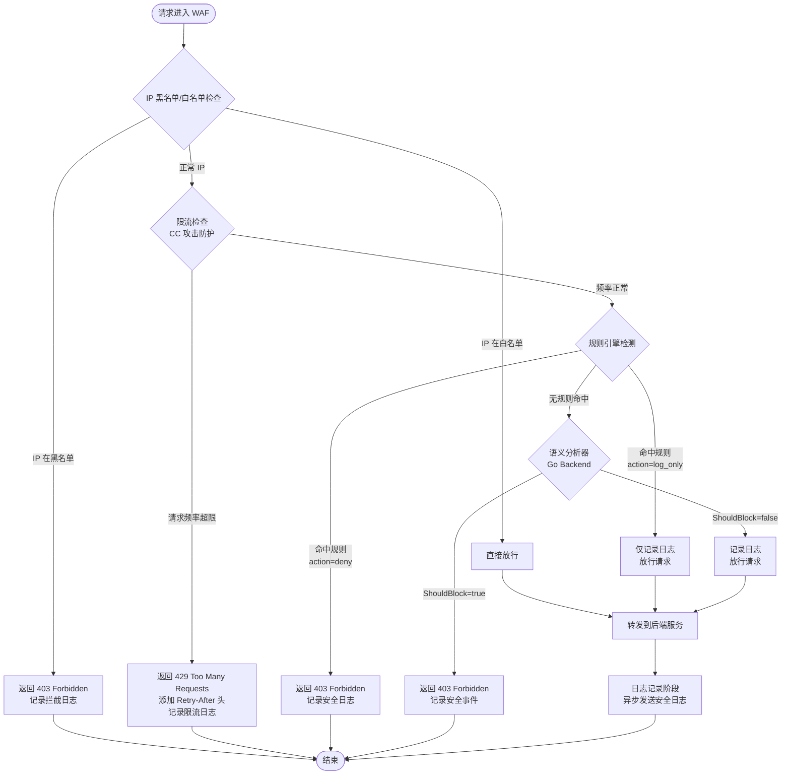
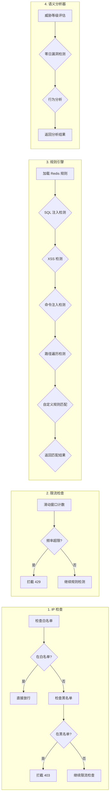
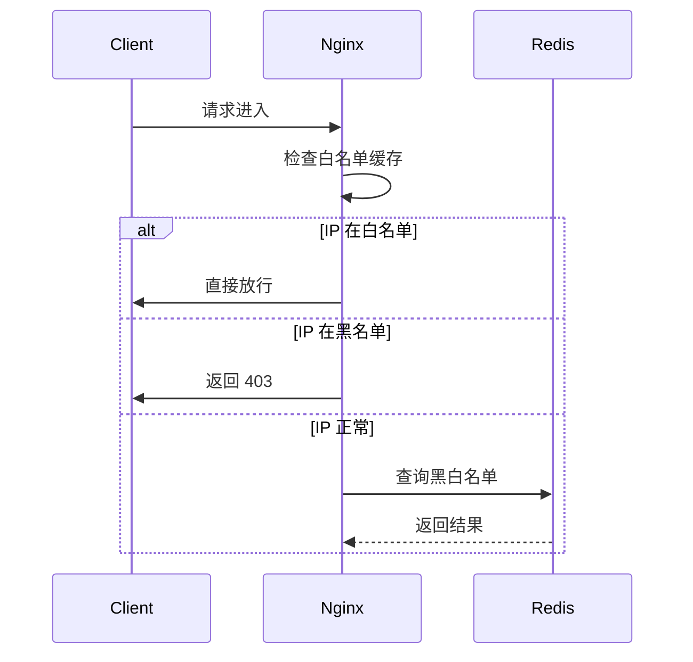
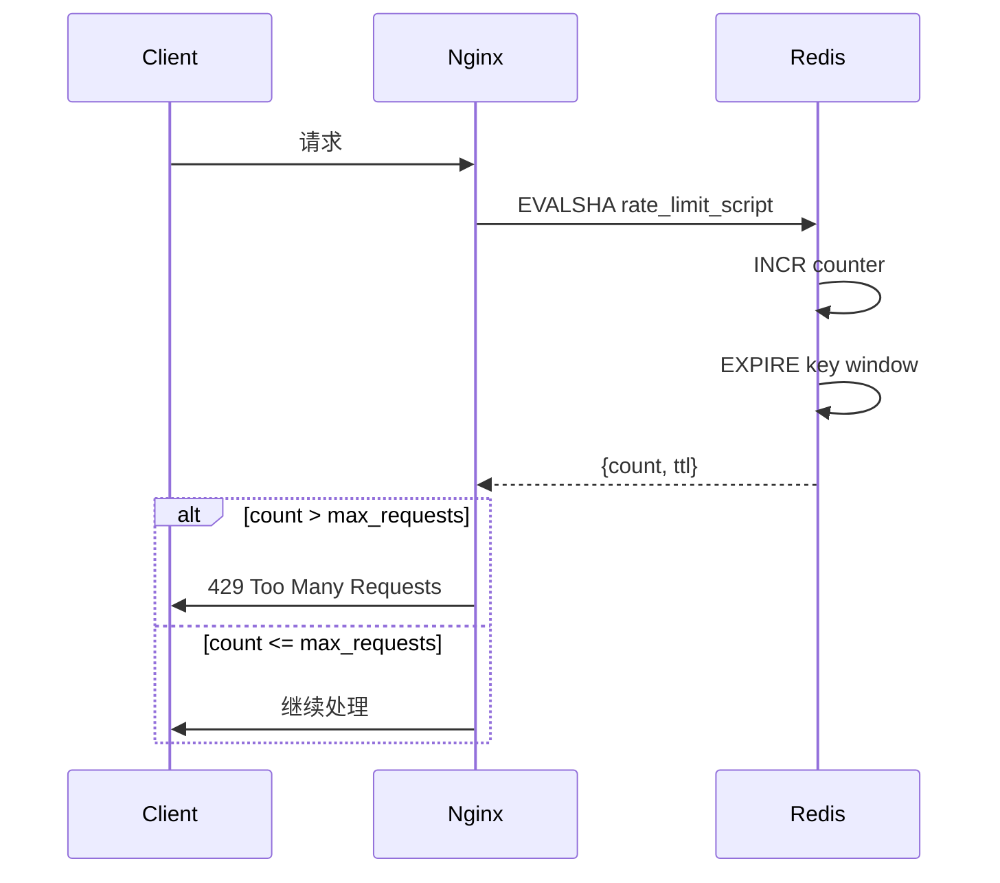
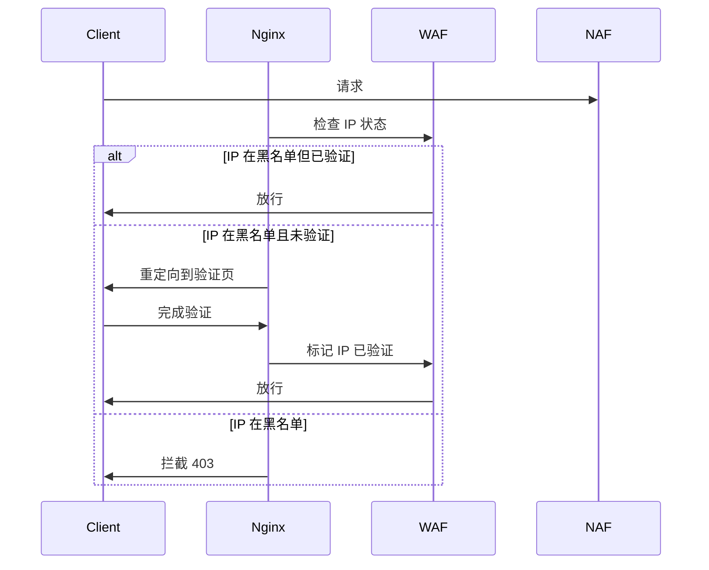
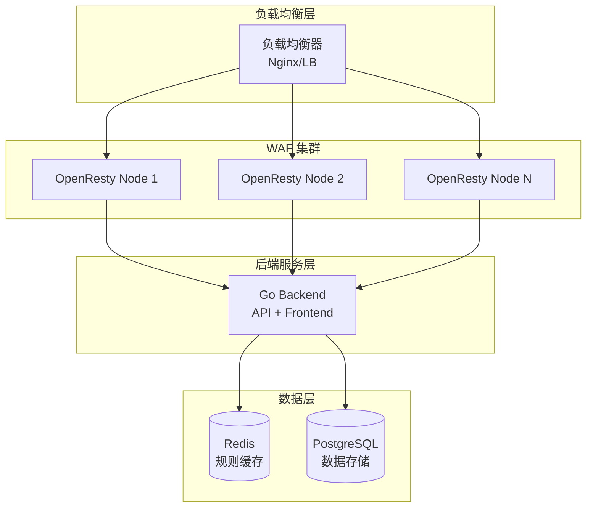
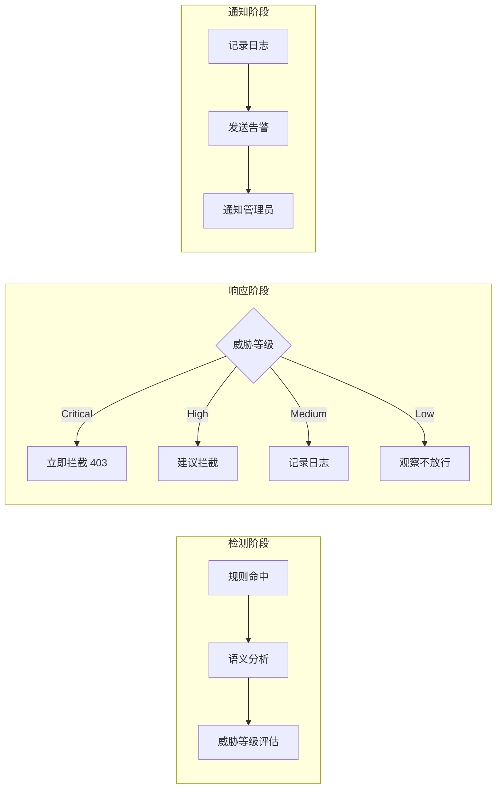

# HyperNeoWAF 应用防火墙

## 项目概述

HyperNeoWAF 是一款基于 **OpenResty + Go** 构建的高性能 Web 应用防火墙（WAF），通过多层次安全检测引擎，为 Web 应用提供全面的威胁防护。

### 核心特性

- **多层安全检测**：Lua 规则引擎 + Go 语义分析器双重防护
- **高性能架构**：OpenResty Nginx 处理高并发流量，Go 后端提供管理 API
- **实时规则更新**：Redis 缓存规则，支持动态更新无需重启服务
- **智能威胁识别**：基于语义分析的可疑请求识别，零日漏洞攻击检测
- **可视化管控**：Vue.js 前端，实时监控安全事件和攻击趋势

---

## 技术架构



---

## 流量过滤流程图



### 详细检测流程



---

## 核心模块说明

### 1. IP 黑名单/白名单模块

- **文件**：[openresty/lua/access/ip_check.lua](openresty/lua/access/ip_check.lua)
- **功能**：基于客户端 IP 进行访问控制
- **特点**：
  - 支持精确 IP 匹配和 CIDR 网段匹配
  - 白名单优先于黑名单
  - 本地缓存 30 秒减少 Redis 查询
  - 支持临时封禁（设置过期时间）



### 2. 限流模块

- **文件**：[openresty/lua/access/rate_limit.lua](openresty/lua/access/rate_limit.lua)
- **功能**：防止 CC 攻击和暴力破解
- **算法**：Redis Lua 脚本实现的滑动窗口计数器
- **维度**：支持按 IP、URL、User-Agent 等多维度限流



### 3. 验证码拦截模块

- **文件**：[backend/internal/service/captcha_service.go](backend/internal/service/captcha_service.go)
- **功能**：恶意 IP 验证放行，避免误拦正常用户
- **特点**：
  - 验证成功后生成 24 小时有效令牌
  - 令牌基于客户端 IP，无需存储
  - 支持自定义验证页面
  - 可视化验证界面（复选框样式）



### 4. 公开恶意 IP 库模块

- **文件**：[backend/internal/service/public_ip_library_service.go](backend/internal/service/public_ip_library_service.go)
- **功能**：定期同步中国科技大学公开恶意 IP 列表
- **数据来源**：https://blackip.ustc.edu.cn
- **署名**：恶意IP列表由中国科技大学（USTC）提供
- **特点**：
  - 支持启用/禁用功能
  - 每日凌晨自动更新
  - 服务启动时自动更新
  - 手动触发更新

### 5. 规则引擎

- **文件**：[openresty/lua/filter/rule_engine.lua](openresty/lua/filter/rule_engine.lua)
- **功能**：基于正则表达式的规则匹配

| 规则类型 | 说明 | 示例 |
|---------|------|------|
| `sql_injection` | SQL 注入检测 | `' OR 1=1--` |
| `xss` | 跨站脚本攻击 | `<script>alert(1)</script>` |
| `cc_attack` | CC 攻击检测 | 高频相似请求 |
| `path_traversal` | 路径遍历 | `../../../etc/passwd` |
| `command_injection` | 命令注入 | `; ls -la` |
| `custom_regex` | 自定义正则 | 用户定义 |

### 6. 语义分析器

- **目录**：[backend/internal/pkg/analyzer/](backend/internal/pkg/analyzer/)

| 分析器 | 文件 | 威胁等级 | 说明 |
|-------|------|---------|------|
| SQL 注入分析器 | sql_analyzer.go | Critical | 存储过程注入、UNION 注入、布尔盲注等 |
| XSS 分析器 | xss_analyzer.go | High | 反射型/存储型 XSS、DOM XSS |
| 命令注入分析器 | command_analyzer.go | Critical | shell 注入、命令替换 |
| 零日漏洞分析器 | zeroday_analyzer.go | Critical | Log4j、Spring4Shell、Apache CVE 等 |
| JS 注入分析器 | js_analyzer.go | High | JavaScript 注入、客户端代码注入 |
| PHP 注入分析器 | php_analyzer.go | Critical | PHP 代码注入、文件包含漏洞 |

#### 威胁等级定义

| 等级 | 值 | 说明 |
|-----|-----|------|
| Safe | 0 | 安全，无威胁 |
| Low | 1 | 低风险，可疑但无害 |
| Medium | 2 | 中风险，需要关注 |
| High | 3 | 高风险，建议拦截 |
| Critical | 4 | 严重风险，必须拦截 |

---

## 管理 API

### 认证接口

| 方法 | 路径 | 说明 |
|-----|------|------|
| POST | `/api/v1/auth/login` | 用户登录 |
| POST | `/api/v1/auth/refresh` | 刷新 Token |
| GET | `/api/v1/auth/profile` | 获取用户信息 |

### 规则管理

| 方法 | 路径 | 说明 |
|-----|------|------|
| GET | `/api/v1/rules` | 列出规则（分页、筛选） |
| POST | `/api/v1/rules` | 创建规则 |
| PUT | `/api/v1/rules/:id` | 更新规则 |
| DELETE | `/api/v1/rules/:id` | 删除规则 |
| PUT | `/api/v1/rules/sync` | 同步规则到 Redis |

### IP 管理

| 方法 | 路径 | 说明 |
|-----|------|------|
| GET | `/api/v1/ip-list` | 列出 IP 名单 |
| POST | `/api/v1/ip-list` | 添加 IP |
| POST | `/api/v1/ip-list/batch-import` | 批量导入 |
| DELETE | `/api/v1/ip-list/:id` | 删除 IP |
| PUT | `/api/v1/ip-list/sync` | 同步到 Redis |

### 日志查询

| 方法 | 路径 | 说明 |
|-----|------|------|
| POST | `/api/v1/logs/receive` | 接收 OpenResty 日志 |
| GET | `/api/v1/logs` | 查询日志 |
| GET | `/api/v1/logs/export` | 导出日志 |

### 仪表盘

| 方法 | 路径 | 说明 |
|-----|------|------|
| GET | `/api/v1/dashboard/stats` | 总体统计 |
| GET | `/api/v1/dashboard/trends` | 趋势数据 |
| GET | `/api/v1/dashboard/recent-events` | 最近事件 |
| GET | `/api/v1/dashboard/top-attacks` | Top 攻击类型 |
| GET | `/api/v1/dashboard/qps` | 实时 QPS |

### 验证码接口

| 方法 | 路径 | 说明 |
|-----|------|------|
| GET | `/api/v1/captcha/generate` | 生成验证码 |
| POST | `/api/v1/captcha/verify` | 验证验证码 |
| GET | `/api/v1/captcha/check` | 检查验证状态 |

### 公开恶意 IP 库

| 方法 | 路径 | 说明 |
|-----|------|------|
| GET | `/api/v1/public-ip-library/status` | 获取状态 |
| POST | `/api/v1/public-ip-library/enabled` | 启用/禁用 |
| POST | `/api/v1/public-ip-library/update` | 手动触发更新 |

---

## 项目结构

```
HyperNeoWAF/
├── backend/                      # Go 后端服务
│   ├── cmd/
│   │   ├── main.go              # 入口函数
│   │   ├── config.go            # 配置加载
│   │   └── handlers.go          # 路由注册
│   ├── configs/
│   │   └── config.yaml           # 配置文件
│   └── internal/
│       ├── api/                 # HTTP 处理器
│       ├── middleware/          # 中间件 (JWT/CORS)
│       ├── model/               # 数据模型
│       ├── pkg/analyzer/        # 语义分析器
│       │   ├── analyzer.go      # 分析器接口
│       │   ├── sql_analyzer.go  # SQL 注入分析
│       │   ├── xss_analyzer.go  # XSS 分析
│       │   ├── command_analyzer.go
│       │   ├── zeroday_analyzer.go
│       │   └── registry.go      # 分析器注册表
│       ├── repository/           # Redis 客户端
│       └── service/             # 业务逻辑层
│
├── frontend/                    # Vue.js 前端
│   └── src/
│       ├── views/
│       │   ├── DashboardView.vue  # 仪表盘
│       │   ├── RulesView.vue     # 规则管理
│       │   ├── IPListView.vue    # IP 管理
│       │   └── LogsView.vue      # 日志查询
│       └── i18n/                # 国际化
│
└── openresty/                   # OpenResty Nginx
    ├── conf/
    │   └── nginx.conf            # Nginx 配置
    └── lua/
        ├── access/
        │   ├── waf_access.lua    # 访问控制入口
        │   ├── ip_check.lua      # IP 检查
        │   └── rate_limit.lua    # 限流
        ├── filter/
        │   └── rule_engine.lua   # 规则引擎
        ├── lib/
        │   ├── config.lua        # 配置加载
        │   ├── redis_pool.lua    # Redis 连接池
        │   └── masking.lua       # 数据脱敏
        └── log/
            ├── logger.lua        # 日志发送
            └── waf_logger.lua    # WAF 日志
```

---

## 部署架构



---

## 安全事件响应流程



---

## 配置说明

### Nginx 配置

**文件**：[openresty/conf/nginx.conf](openresty/conf/nginx.conf)

关键配置项：
- `lua_package_path`：Lua 模块搜索路径
- `lua_shared_dict`：共享内存字典（规则缓存、限流计数）
- `init_by_lua_block`：服务启动时初始化 Redis 连接池
- `access_by_lua_file`：请求拦截入口

### 后端配置

**文件**：[backend/configs/config.yaml](backend/configs/config.yaml)

```yaml
server:
  port: 8080
  mode: debug  # debug/release/test

database:
  host: localhost
  port: 5432
  user: waf_admin
  password: ${DB_PASSWORD}
  dbname: waf_db

redis:
  host: localhost
  port: 6379
  password: ${REDIS_PASSWORD}

jwt:
  secret: ${JWT_SECRET}
  access_token_ttl: 24h
  refresh_token_ttl: 168h
```

---

## 后续开发计划

- [x] 增加公开恶意 IP 库
- [x] 增加验证码拦截
- [ ] 增加 AI 分析引擎
- [ ] 优化运行效率

---

## 联系方式

- **邮箱**：1069137617@qq.com

> ⚠️ **开发阶段提示**：本项目目前处于开发阶段，部分功能暂时不可使用。可联系邮箱 1069137617@qq.com 加入开发。
