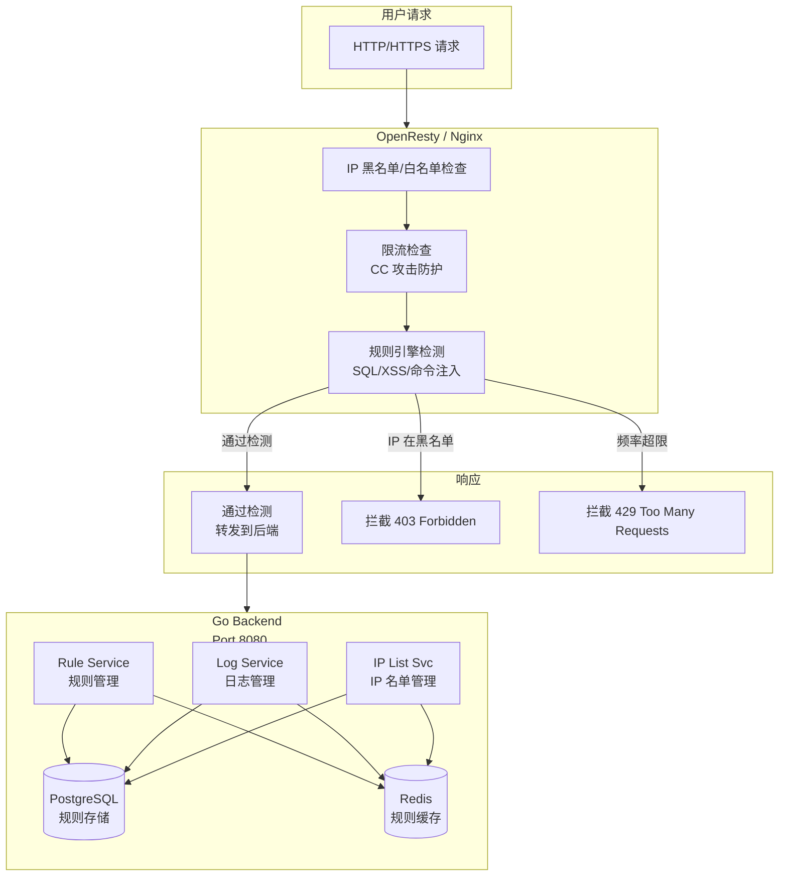
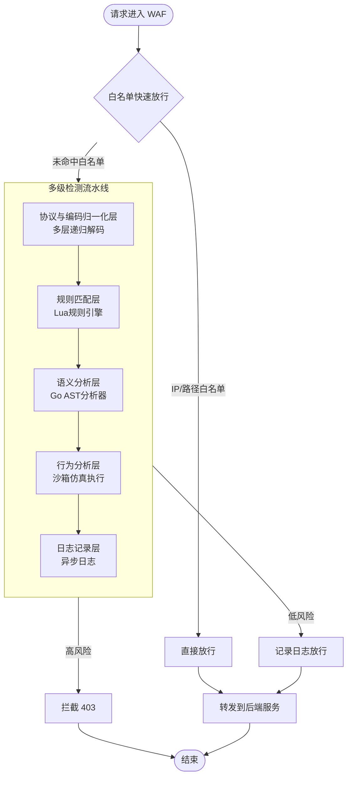
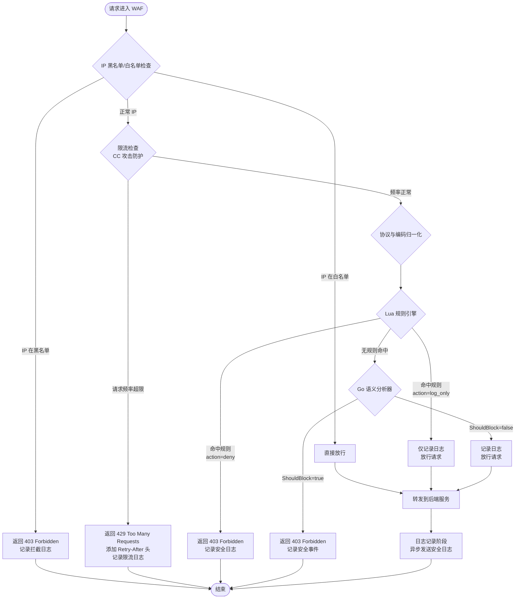
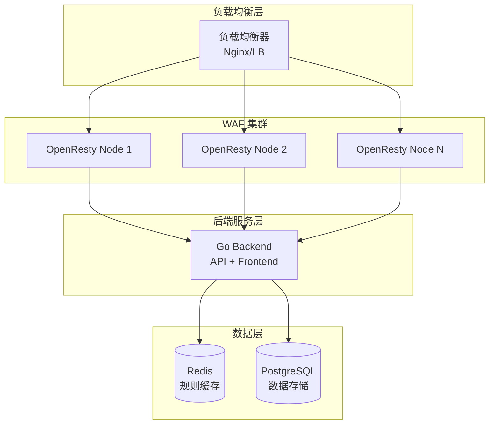

# HyperNeoWAF 应用防火墙

> ⚠️ **开发阶段提示**：本项目目前处于开发阶段，大部分功能暂不可使用或尚未完工。部分分析器模块已实现但尚未完全集成。联系邮箱 <1069137617@qq.com> 加入开发。

## 项目概述

HyperNeoWAF（新一代WAF）是一款基于 **OpenResty + Go** 构建的高性能 Web 应用防火墙（WAF），通过多层次安全检测引擎，为 Web 应用提供全面的威胁防护。

### 核心特性

- **多层安全检测**：Lua 规则引擎 + Go 语义分析器双重防护
- **高性能架构**：OpenResty Nginx 处理高并发流量，Go 后端提供管理 API
- **实时规则更新**：Redis 缓存规则，支持动态更新无需重启服务
- **智能威胁识别**：基于语义分析的可疑请求识别，零日漏洞攻击检测
- **可视化管控**：Vue.js 前端，实时监控安全事件和攻击趋势
- **插件化设计**：所有分析器可插拔、可开关、可配置
- **防绕过优先**：拒绝纯正则，采用语义/上下文/执行链检测

### 新一代防绕过技术

HyperNeoWAF 采用以下核心技术防止攻击绕过：

| 技术     | 说明                                      |
| ------ | --------------------------------------- |
| 多层递归解码 | URL/Unicode/HTML/UTF-7/JS转义/Base64 多层解码 |
| 语义解析   | SQL/XSS/命令注入的 AST 语法树分析                 |
| 上下文感知  | HTML/JS/CSS/URL/JSON 输出上下文识别            |
| 执行链追踪  | 命令注入链路和反弹Shell检测                        |
| 沙箱仿真   | 高危Payload意图判定，极低误报                      |

***

## 技术架构



### 多级检测流水线



***

## 核心模块说明

### 1. 协议与编码归一化分析器 ⚠️ 开发中

- **文件**：[backend/internal/pkg/analyzer/decoder.go](backend/internal/pkg/analyzer/decoder.go)
- **功能**：多层递归解码，防编码混淆绕过
- **状态**：已实现基础功能

| 解码类型      | 说明                   |
| --------- | -------------------- |
| URL解码     | 单层/多层递归解码            |
| Unicode解码 | \uHHHH 格式            |
| HTML实体解码  | \&#xxx; 和 \&#xHH; 格式 |
| UTF-7解码   | +BASE64- 模式          |
| JS转义解码    | \xHH, \uHHHH         |
| Base64解码  | 递归检测                 |

### 2. HTTP协议规范化分析器 ⚠️ 开发中

- **文件**：[backend/internal/pkg/analyzer/http\_normalizer.go](backend/internal/pkg/analyzer/http_normalizer.go)
- **功能**：标准化畸形请求，防协议畸形绕过WAF
- **状态**：已实现基础功能

| 功能       | 说明                           |
| -------- | ---------------------------- |
| 畸形请求标准化  | 缺少CR的换行、非法控制字符               |
| 分块传输重组   | chunked transfer encoding 解析 |
| 非法换行/头处理 | 重复头、Host头注入检测                |

### 3. 多格式深度解析器 ⚠️ 开发中

- **文件**：[backend/internal/pkg/analyzer/format\_parser.go](backend/internal/pkg/analyzer/format_parser.go)
- **功能**：form/json/xml/multipart全字段提取
- **状态**：已实现基础功能

### 4. SQL注入语义分析器 ⚠️ 开发中

- **文件**：[backend/internal/pkg/analyzer/sql\_analyzer.go](backend/internal/pkg/analyzer/sql_analyzer.go)
- **文件**：[backend/internal/pkg/analyzer/sql\_ast.go](backend/internal/pkg/analyzer/sql_ast.go)
- **功能**：SQL语法树AST解析，语义意图分析
- **状态**：已实现AST解析器

| 分析器        | 文件          | 说明                 |
| ---------- | ----------- | ------------------ |
| SQL AST解析器 | sql\_ast.go | UNION/盲注/报错/堆叠注入解析 |
| SQL语义意图分析器 | sql\_ast.go | 数据变指令/权限提升检测       |

### 5. XSS攻击分析器 ⚠️ 开发中

- **文件**：[backend/internal/pkg/analyzer/xss\_analyzer.go](backend/internal/pkg/analyzer/xss_analyzer.go)
- **文件**：[backend/internal/pkg/analyzer/xss\_context.go](backend/internal/pkg/analyzer/xss_context.go)
- **功能**：XSS AST语法树分析，上下文感知检测
- **状态**：已实现上下文感知

| 上下文类型         | 说明                 |
| ------------- | ------------------ |
| HTML标签上下文     | 标签内、标签外            |
| HTML属性上下文     | 双引号/单引号/无引号        |
| JavaScript上下文 | script标签内、事件处理器内   |
| CSS上下文        | style属性内           |
| URL上下文        | href, src, action等 |

### 6. 命令注入执行链分析器 ⚠️ 开发中

- **文件**：[backend/internal/pkg/analyzer/command\_analyzer.go](backend/internal/pkg/analyzer/command_analyzer.go)
- **文件**：[backend/internal/pkg/analyzer/command\_chain.go](backend/internal/pkg/analyzer/command_chain.go)
- **功能**：命令执行链路分析，反弹Shell检测
- **状态**：已实现执行链分析

| 检测类型      | 说明                       |
| --------- | ------------------------ |
| 命令分隔符解析   | ;, \|, &, &&, \|\|       |
| 管道分析      | 检测管道连接的多个命令              |
| 反弹Shell检测 | /dev/tcp, nc -e, bash -i |
| 编码混淆解析    | URL编码、base64、hex         |

### 7. 文件安全分析器 ⚠️ 开发中

- **文件**：[backend/internal/pkg/analyzer/file\_analyzer.go](backend/internal/pkg/analyzer/file_analyzer.go)
- **文件**：[backend/internal/pkg/analyzer/upload\_analyzer.go](backend/internal/pkg/analyzer/upload_analyzer.go)
- **功能**：LFI/RFI路径分析，文件上传检测
- **状态**：已实现基础功能

| 分析器            | 说明                      |
| -------------- | ----------------------- |
| LFI/RFI路径语义分析器 | 目录穿越、伪协议、敏感路径、Windows短名 |
| 文件上传结构分析器      | 魔数检测、图片马、EXIF恶意内容       |

### 8. 表达式与模板注入分析器 ⚠️ 开发中

- **文件**：[backend/internal/pkg/analyzer/ssti\_analyzer.go](backend/internal/pkg/analyzer/ssti_analyzer.go)
- **文件**：[backend/internal/pkg/analyzer/expression\_analyzer.go](backend/internal/pkg/analyzer/expression_analyzer.go)
- **功能**：SSTI/JNDI/EL/SpEL表达式检测
- **状态**：已实现

| 模板引擎       | 说明                  |
| ---------- | ------------------- |
| Jinja2     | {{ }}, , {# #} |
| Twig       | {{ }},         |
| FreeMarker | ${ }, <# >          |
| OGNL       | ${ }, %{}           |

### 9. 沙箱仿真执行 ⚠️ 开发中

- **文件**：[backend/internal/pkg/analyzer/sandbox.go](backend/internal/pkg/analyzer/sandbox.go)
- **功能**：高危Payload意图判定
- **状态**：已实现轻量级仿真

### 10. 协议解析增强 ⚠️ 开发中

| 分析器             | 文件                     | 说明                  |
| --------------- | ---------------------- | ------------------- |
| WebSocket检测     | websocket\_analyzer.go | 全流量检测               |
| gRPC/Protobuf检测 | grpc\_analyzer.go      | 反序列化检测              |
| JSONP/AJAX检测    | jsonp\_analyzer.go     | 上下文识别               |
| Body解压          | body\_decompressor.go  | Gzip/Deflate/Brotli |
| 宽字符检测           | charset\_analyzer.go   | GBK/UTF-8           |
| 跨参数拼接           | parameter\_analyzer.go | 注入重组检测              |

### 11. 专项安全防护 ⚠️ 开发中

| 分析器      | 文件                           | 说明              |
| -------- | ---------------------------- | --------------- |
| XXE语义分析器 | xxe\_analyzer.go             | XML外部实体检测       |
| CSRF令牌校验 | csrf\_analyzer.go            | 令牌校验引擎          |
| 路径遍历深度分析 | path\_traversal\_analyzer.go | 标准化路径解析         |
| 反序列化攻击检测 | deserialization\_analyzer.go | Java/PHP/Python |
| 爬虫&扫描器识别 | crawler\_analyzer.go         | 恶意UA识别          |

### 12. 核心架构 ⚠️ 开发中

| 模块      | 文件           | 说明           |
| ------- | ------------ | ------------ |
| 多级检测流水线 | pipeline.go  | 白名单→规则→语义三层  |
| 规则热重载   | hotreload.go | 虚拟补丁系统       |
| 内存级缓存   | cache.go     | IP信誉/会话/参数基线 |

***

## 流量过滤流程图



***

## 语义分析器清单 ⚠️ 开发中

| 分析器             | 文件                           | 威胁等级     | 状态  |
| --------------- | ---------------------------- | -------- | --- |
| SQL注入AST分析器     | sql\_ast.go                  | Critical | 已实现 |
| SQL语义意图分析器      | sql\_analyzer.go             | Critical | 已实现 |
| XSS上下文感知分析器     | xss\_context.go              | High     | 已实现 |
| XSS基础分析器        | xss\_analyzer.go             | High     | 已实现 |
| 命令执行链分析器        | command\_chain.go            | Critical | 已实现 |
| 命令注入基础分析器       | command\_analyzer.go         | Critical | 已实现 |
| LFI/RFI路径分析器    | file\_analyzer.go            | High     | 已实现 |
| 文件上传分析器         | upload\_analyzer.go          | High     | 已实现 |
| SSTI模板注入分析器     | ssti\_analyzer.go            | Critical | 已实现 |
| 表达式注入分析器        | expression\_analyzer.go      | Critical | 已实现 |
| XXE语义分析器        | xxe\_analyzer.go             | Critical | 已实现 |
| CSRF令牌校验引擎      | csrf\_analyzer.go            | Medium   | 已实现 |
| 路径遍历深度分析器       | path\_traversal\_analyzer.go | High     | 已实现 |
| 反序列化攻击检测器       | deserialization\_analyzer.go | Critical | 已实现 |
| 爬虫&扫描器识别器       | crawler\_analyzer.go         | Low      | 已实现 |
| 多层递归解码分析器       | decoder.go                   | Medium   | 已实现 |
| HTTP协议规范化分析器    | http\_normalizer.go          | Medium   | 已实现 |
| 多格式深度解析器        | format\_parser.go            | Medium   | 已实现 |
| WebSocket全流量检测  | websocket\_analyzer.go       | High     | 已实现 |
| gRPC/Protobuf检测 | grpc\_analyzer.go            | High     | 已实现 |
| JSONP/AJAX上下文识别 | jsonp\_analyzer.go           | Medium   | 已实现 |
| 请求Body多格式解压     | body\_decompressor.go        | Medium   | 已实现 |
| 宽字符注入检测         | charset\_analyzer.go         | Medium   | 已实现 |
| 跨参数拼接注入检测       | parameter\_analyzer.go       | High     | 已实现 |
| 沙箱仿真执行器         | sandbox.go                   | Critical | 已实现 |
| 多级检测流水线         | pipeline.go                  | High     | 已实现 |
| 规则热重载机制         | hotreload.go                 | Medium   | 已实现 |
| 内存级缓存机制         | cache.go                     | Medium   | 已实现 |
| 零日漏洞分析器         | zeroday\_analyzer.go         | Critical | 已存在 |
| JS注入分析器         | js\_analyzer.go              | High     | 已存在 |
| PHP注入分析器        | php\_analyzer.go             | Critical | 已存在 |

#### 威胁等级定义

| 等级       | 值 | 说明        |
| -------- | - | --------- |
| Safe     | 0 | 安全，无威胁    |
| Low      | 1 | 低风险，可疑但无害 |
| Medium   | 2 | 中风险，需要关注  |
| High     | 3 | 高风险，建议拦截  |
| Critical | 4 | 严重风险，必须拦截 |

***

## 项目结构

```
HyperNeoWAF/
├── backend/                      # Go 后端服务
│   ├── cmd/
│   │   ├── main.go              # 入口函数
│   │   ├── config.go            # 配置加载
│   │   └── handlers.go          # 路由注册
│   ├── configs/
│   │   └── config.yaml           # 配置文件
│   └── internal/
│       ├── api/                 # HTTP 处理器
│       ├── middleware/          # 中间件 (JWT/CORS)
│       ├── model/               # 数据模型
│       ├── pkg/analyzer/        # 语义分析器
│       │   ├── analyzer.go      # 分析器接口定义
│       │   ├── registry.go      # 分析器注册表
│       │   ├── analyzer_settings.go  # 分析器配置
│       │   ├── pipeline.go      # 多级检测流水线 ⚠️
│       │   ├── hotreload.go     # 规则热重载 ⚠️
│       │   ├── cache.go         # 内存级缓存 ⚠️
│       │   ├── decoder.go       # 多层递归解码 ⚠️
│       │   ├── http_normalizer.go  # HTTP协议规范化 ⚠️
│       │   ├── format_parser.go  # 多格式深度解析 ⚠️
│       │   ├── sql_analyzer.go  # SQL注入分析（基础）
│       │   ├── sql_ast.go       # SQL语法树AST解析 ⚠️
│       │   ├── xss_analyzer.go  # XSS分析（基础）
│       │   ├── xss_context.go   # XSS上下文感知 ⚠️
│       │   ├── command_analyzer.go  # 命令注入（基础）
│       │   ├── command_chain.go  # 命令执行链分析 ⚠️
│       │   ├── file_analyzer.go  # LFI/RFI路径分析 ⚠️
│       │   ├── upload_analyzer.go  # 文件上传分析 ⚠️
│       │   ├── ssti_analyzer.go  # SSTI模板注入 ⚠️
│       │   ├── expression_analyzer.go  # 表达式注入 ⚠️
│       │   ├── sandbox.go       # 沙箱仿真执行 ⚠️
│       │   ├── websocket_analyzer.go  # WebSocket检测 ⚠️
│       │   ├── grpc_analyzer.go  # gRPC检测 ⚠️
│       │   ├── jsonp_analyzer.go  # JSONP检测 ⚠️
│       │   ├── body_decompressor.go  # Body解压 ⚠️
│       │   ├── charset_analyzer.go  # 宽字符检测 ⚠️
│       │   ├── parameter_analyzer.go  # 跨参数拼接 ⚠️
│       │   ├── xxe_analyzer.go   # XXE检测 ⚠️
│       │   ├── csrf_analyzer.go  # CSRF检测 ⚠️
│       │   ├── path_traversal_analyzer.go  # 路径遍历 ⚠️
│       │   ├── deserialization_analyzer.go  # 反序列化 ⚠️
│       │   ├── crawler_analyzer.go  # 爬虫扫描器识别 ⚠️
│       │   ├── zeroday_analyzer.go  # 零日漏洞（已存在）
│       │   ├── js_analyzer.go     # JS注入（已存在）
│       │   └── php_analyzer.go    # PHP注入（已存在）
│       ├── repository/           # Redis 客户端
│       └── service/             # 业务逻辑层
│
├── frontend/                    # Vue.js 前端
│   └── src/
│       ├── views/
│       │   ├── DashboardView.vue  # 仪表盘
│       │   ├── RulesView.vue     # 规则管理
│       │   ├── IPListView.vue    # IP 管理
│       │   └── LogsView.vue      # 日志查询
│       └── i18n/                # 国际化
│
└── openresty/                   # OpenResty Nginx
    ├── conf/
    │   └── nginx.conf            # Nginx 配置
    └── lua/
        ├── access/
        │   ├── waf_access.lua    # 访问控制入口
        │   ├── ip_check.lua      # IP 检查
        │   └── rate_limit.lua    # 限流
        ├── filter/
        │   └── rule_engine.lua   # 规则引擎
        ├── lib/
        │   ├── config.lua        # 配置加载
        │   ├── redis_pool.lua    # Redis 连接池
        │   └── masking.lua       # 数据脱敏
        └── log/
            ├── logger.lua        # 日志发送
            └── waf_logger.lua    # WAF 日志
```

> ⚠️ 标记的文件为本次开发新增或修改的模块

***

## 管理 API

### 认证接口

| 方法   | 路径                     | 说明       | 状态 |
| ---- | ---------------------- | -------- | -- |
| POST | `/api/v1/auth/login`   | 用户登录     | ✅  |
| POST | `/api/v1/auth/refresh` | 刷新 Token | ✅  |
| GET  | `/api/v1/auth/profile` | 获取用户信息   | ✅  |

### 规则管理

| 方法     | 路径                   | 说明          | 状态 |
| ------ | -------------------- | ----------- | -- |
| GET    | `/api/v1/rules`      | 列出规则（分页、筛选） | ✅  |
| POST   | `/api/v1/rules`      | 创建规则        | ✅  |
| PUT    | `/api/v1/rules/:id`  | 更新规则        | ✅  |
| DELETE | `/api/v1/rules/:id`  | 删除规则        | ✅  |
| PUT    | `/api/v1/rules/sync` | 同步规则到 Redis | ✅  |

### IP 管理

| 方法     | 路径                             | 说明        | 状态 |
| ------ | ------------------------------ | --------- | -- |
| GET    | `/api/v1/ip-list`              | 列出 IP 名单  | ✅  |
| POST   | `/api/v1/ip-list`              | 添加 IP     | ✅  |
| POST   | `/api/v1/ip-list/batch-import` | 批量导入      | ✅  |
| DELETE | `/api/v1/ip-list/:id`          | 删除 IP     | ✅  |
| PUT    | `/api/v1/ip-list/sync`         | 同步到 Redis | ✅  |

### 日志查询

| 方法   | 路径                     | 说明              | 状态 |
| ---- | ---------------------- | --------------- | -- |
| POST | `/api/v1/logs/receive` | 接收 OpenResty 日志 | ✅  |
| GET  | `/api/v1/logs`         | 查询日志            | ✅  |
| GET  | `/api/v1/logs/export`  | 导出日志            | ✅  |

### 仪表盘

| 方法  | 路径                                | 说明       | 状态 |
| --- | --------------------------------- | -------- | -- |
| GET | `/api/v1/dashboard/stats`         | 总体统计     | ✅  |
| GET | `/api/v1/dashboard/trends`        | 趋势数据     | ✅  |
| GET | `/api/v1/dashboard/recent-events` | 最近事件     | ✅  |
| GET | `/api/v1/dashboard/top-attacks`   | Top 攻击类型 | ✅  |
| GET | `/api/v1/dashboard/qps`           | 实时 QPS   | ✅  |

### 验证码接口

| 方法   | 路径                         | 说明     | 状态 |
| ---- | -------------------------- | ------ | -- |
| GET  | `/api/v1/captcha/generate` | 生成验证码  | ✅  |
| POST | `/api/v1/captcha/verify`   | 验证验证码  | ✅  |
| GET  | `/api/v1/captcha/check`    | 检查验证状态 | ✅  |

### 公开恶意 IP 库

| 方法   | 路径                                  | 说明     | 状态 |
| ---- | ----------------------------------- | ------ | -- |
| GET  | `/api/v1/public-ip-library/status`  | 获取状态   | ✅  |
| POST | `/api/v1/public-ip-library/enabled` | 启用/禁用  | ✅  |
| POST | `/api/v1/public-ip-library/update`  | 手动触发更新 | ✅  |

### 分析器管理 ⚠️ 开发中

| 方法  | 路径                                | 说明      | 状态 |
| --- | --------------------------------- | ------- | -- |
| GET | `/api/v1/analyzers`               | 列出所有分析器 | ⚠️ |
| GET | `/api/v1/analyzers/:name`         | 获取分析器详情 | ⚠️ |
| PUT | `/api/v1/analyzers/:name/enable`  | 启用分析器   | ⚠️ |
| PUT | `/api/v1/analyzers/:name/disable` | 禁用分析器   | ⚠️ |
| PUT | `/api/v1/analyzers/:name/config`  | 配置分析器   | ⚠️ |

***

## 部署架构



***

## 配置说明

### Nginx 配置

**文件**：[openresty/conf/nginx.conf](openresty/conf/nginx.conf)

关键配置项：

- `lua_package_path`：Lua 模块搜索路径
- `lua_shared_dict`：共享内存字典（规则缓存、限流计数）
- `init_by_lua_block`：服务启动时初始化 Redis 连接池
- `access_by_lua_file`：请求拦截入口

### 后端配置

**文件**：[backend/configs/config.yaml](backend/configs/config.yaml)

```yaml
server:
  port: 8080
  mode: debug  # debug/release/test

database:
  host: localhost
  port: 5432
  user: waf_admin
  password: ${DB_PASSWORD}
  dbname: waf_db

redis:
  host: localhost
  port: 6379
  password: ${REDIS_PASSWORD}

jwt:
  secret: ${JWT_SECRET}
  access_token_ttl: 24h
  refresh_token_ttl: 168h
```

***

## 开发进度

### ✅ 已完成

- [x] 项目基础架构（OpenResty + Go）
- [x] IP 黑名单/白名单模块
- [x] 限流模块（CC 攻击防护）
- [x] Lua 规则引擎
- [x] 验证码拦截模块
- [x] 公开恶意 IP 库模块
- [x] 管理 API（认证、规则、IP、日志、仪表盘）
- [x] Vue.js 前端界面
- [x] 所有语义分析器基础实现（Phase 1-10）
- [x] 多级检测流水线
- [x] 规则热重载机制
- [x] 内存级缓存机制

### ⚠️ 开发中/待完成

- [ ] 分析器与 Pipeline 集成
- [ ] 规则热重载与应用生效
- [ ] 前端分析器管理界面
- [ ] 单元测试覆盖
- [ ] 性能基准测试
- [ ] 安全测试（绕过测试、误报测试）
- [ ] 完整文档

### 📋 计划中

- [ ] AI 分析引擎
- [ ] 机器学习异常检测
- [ ] 分布式协同防护
- [ ] 云原生支持（Kubernetes）

***

## 联系方式

- **邮箱**：<1069137617@qq.com>

> ⚠️ **开发阶段提示**：本项目目前处于开发阶段，大部分功能暂不可使用或尚未完工。分析器模块已实现但尚未完全集成到检测流程中。联系邮箱 <1069137617@qq.com> 加入开发。

